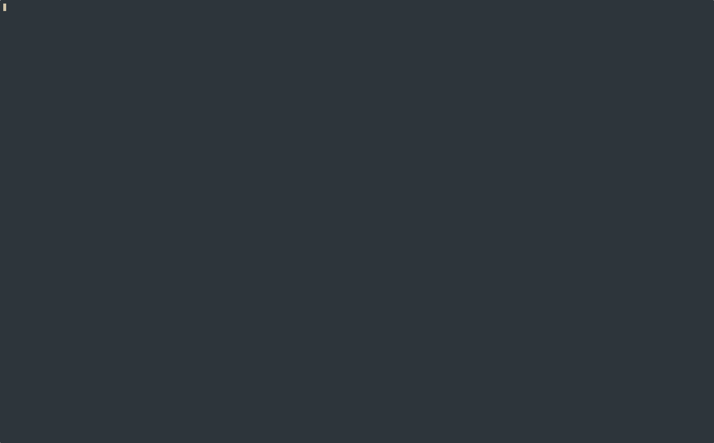

# Blackjack TUI

## Description

This is an implementation of the game blackjack in a Terminal UI format. The application has two parts, the server and the client. Eventually it will be finished so you can launch either with a CLI command and play blackjack over the internet with your friends. To start this project I used Claude to create a project spec which I could follow and implement to work on my programming chops. I have used Claude as well to try and think through problems, but all of the code in the project is grass-fed and hand-written by yours truly.

## Motivation

Have you ever thought that people are making games too complicated? Why do I need JAVASCRIPT when I can just run things in the terminal? Why do I need a WEBSITE when I can just have a server? These are the questions I'm trying to answer by building blackjack TUI. The terminal-based blackjack game that prevents you from having to interact with javascript ever again.

My goal in creating this project is to learn more about how to design software well. I'm learning that the key to good software is minimizing complexity. I intend to get this reviewed by some people in a discord chat when I'm done and see what kind of improvements I could make on it. Really the goal is to become the best software engineer I can and learn to do things excellently. Also I think building projects like this will help hone my instinct on how software should be built and designed.

## Quick Start

The server will automatically run on localhost:8080. I haven't configured this part yet so that's just how it works.
To run the server you can run the command:
`go run . -f=server`

the -f flag will set the mode for your command to determine whether to run the client or the server.

To run the client TUI:
`DEBUG=1 go run . -f=tui`

To run the client in mock mode:
`DEBUG=1 go run . -f=tui --mock`

For now, you need to set the debug mode to true or the log statements will mess up your client

## Usage

### Flags:

-f -- the format you want to run the application in.
Available Options: "tui", "server"
--mock -- run the TUI in mock mode to be able to see the changes you make without needing to connect to a server

## How to play

To play, just hit the c key after you click through the splash screen. This will [c]onnect your client to the server.
Then you can create a new table and start playing blackjack against the computer! The commands should be on screen to tell you what buttons to press :)

## Contributing

Thanks for checking out my project! If you have any suggestions or tips for me feel free to send me a message or open an issue. I'd love to hear what you have to say.
