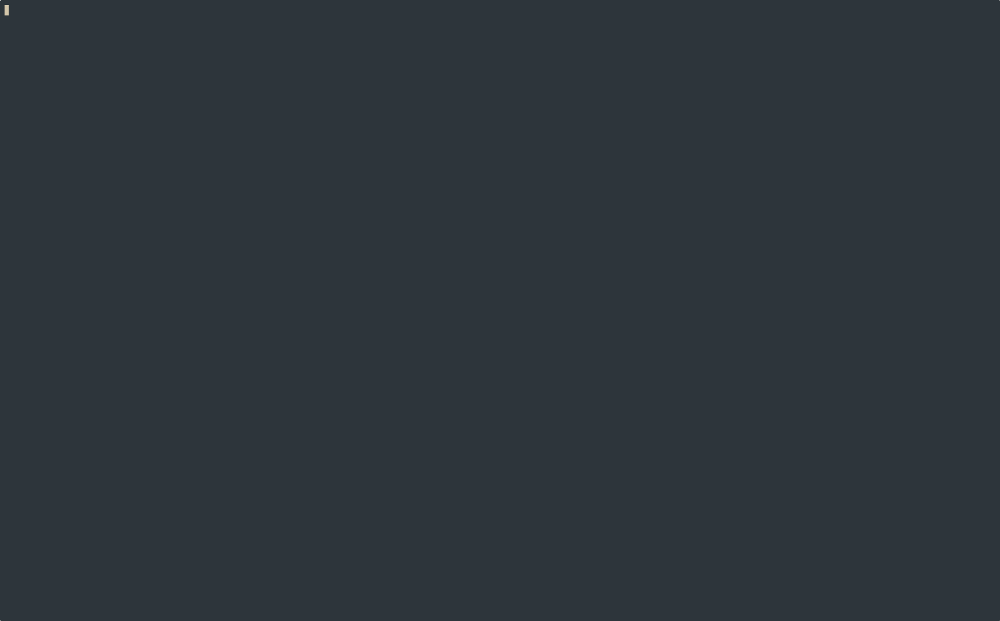

# Blackjack TUI


[](https://github.com/dylanmccormick/blackjack-tui)
[](https://github.com/dylanmccormick/blackjack-tui/blob/master/LICENSE)



## Description

Blackjack Played in the Terminal! This implementation of blackjack is a fun, terminal-based way to play blackjack at home. This project uses websockets to connect to a server so you can host your own or connect to the publicly available server.

## Motivation

I built this project to learn a lot more about writing production-level Go code. This is one of my first larger-scale projects that includes websockets, terminal ui, and databases. While working on this project I wanted to focus on designing software that was easy to work with and understandable. I wanted to learn more about how to use the Go standard library and about concurrency in Go. One of the cool things I experimented with was chaos/ simulation testing. Turn on the server and let a bunch of clients connect and do random actions. It was a great way to test out my server and I'm looking forward to adding that to more projects in the future.

## Technical Highlights

- Client/Server architecture to allow friends to play together over the internet.
- Actor model concurrency pattern. - single-threaded actors with message passing via channels instead of using mutexes
- Prometheus metrics endpoint `/metrics` - cool way to keep track of interactions with the project
- docker deployment with traefik reverse proxy
- github actions - running tests on push and using releases
- Gihub Oauth device flow - allow for signing in with github account instead of creating my own authentication system
- TUI using Elm architecture (BubbleTea)

## Quick Start

**Play on Public Server**

```bash
go install github.com/dylanmccormick/blackjack-tui@latest
blackjack-tui tui
```

**Run Your Own Server**

```bash
go install github.com/dylanmccormick/blackjack-tui@latest
blackjack-tui tui
```

### 1. Get the code

```
git clone https://github.com/dylanmccormick/blackjack-tui
cd blackjack-tui
```

### 2. Set up environment

`cp .env.example .env`

### Edit .env with your GitHub OAuth Client ID

```bash
# GitHub OAuth Application Client ID
# Create one at: https://github.com/settings/developers
GIT_CLIENT_ID=your_client_id_here
# Database location
SQLITE_DB=./blackjack-db.db
```

### Run server

The server will automatically run on localhost:42069. You can change the `config.yaml` file to update what port you want the server to work on.
You could update config.yaml to change any of the settings for the server
To run the server you can run the command:

`go run . server`

In another terminal, run client

`go run . tui`

## Usage

### Arguments:

tui - This argument will run the TUI for the game
server - this argument will run the server for the game

Available Options: "tui", "server"

--mock -- run the TUI in mock mode to be able to see the changes you make without needing to connect to a server
`blackjack-tui tui --mock`

## How to play

You will need a github login (I assume you have one if you're reading this). To start you can select one of the servers in the server menu or host your own server. From that screen you will be able to log in to github to start playing blackjack! You will get income every day that you visit the application and there may be a bonus for streaks and a special hidden bonus (⭐?).

Then you can create a new table and start playing blackjack against the computer! The commands should be on screen to tell you what buttons to press :)

## Contributing

Thanks for checking out my project! If you have any suggestions or tips for me feel free to send me a message or open an issue. I'd love to hear what you have to say.

## Interesting Problems I solved

### Chaos Testing

Chaos testing is a big topic at a lot of large scale companies. Really, the best way to test your application is to try your hardest to break it. Well, I figured I would try my hand at that kind of testing. 

Initially, I was not confident how my project would handle load, random actions, or bad actors. I had been testing with just me logging into the server and playing a few hands of blackjack! Well, it turns out that could create some issues. Once I started trying to connect multiple clients at once, the server was behaving unexpectedly. I figured there were probably race conditions happening, but I couldn't figure out how to reproduce them manually. So I built a little framework to run chaos tests for me. Right now, the framework is still in its infancy, but I think I have the start of a complete chaos test suite. 

My idea when building the chaos tests was to have different kind of actors spawned and connected to the server running at the same time. You have the golden path actors, who basically do whatever you're supposed to, but then you have all of the bad actors. The people who spam commands, sit idle, leave and join repeatedly, etc. These are really the cases your server needs to handle. You need to handle everything that you don't expect to happen. Through this testing, I realized that when running a bunch of random agents, the rounds were not progressing. I wasn't sure why. I figured it had to do with the random nature of betting, standing, hitting, and other actions from the agents. I just guessed that not all of them were betting to start the round and then not standing for their turn in order. So, I went to golden path testing to see if I could make a happy path for the game. This is where things got interesting. 

When I set up 1 agent to run with happy path, everything was working fine. When I set up two agents, everything, again, worked fine! However, when I set up 4 agents to run at the same time, rounds were not completing. The server was not sending update and the agents just kept spamming with continued bets or turn actions. Through this process I realized that all of my agents were sending commands at the same time, which the server could not handle. I did not have any queue for these messages so they were just getting dropped! Also, whenever I started a round, I didn't stop the bet timeout timer. So halfway through the round, players would be marked as inactive and the game state would randomly change. After some more experimentation and digging, I found that I needed to STOP the betTimer on round start and I needed to have a buffer for all of the incoming messages to the server. 

It was a breat way to learn the effectiveness of chaos testing for applications!

### Interacting With Game State
One of the more challenging problems was how to properly interact with the game state. I think that figuring out how to auto-progress the game between each player's turn is not super simple. I decided that each of the actions taken on the game should be done from outside of the game and the game object should just validate if those actions are appropriate. You'll see in the code for `server/table.go`, I am doing all of the game flow there. This made it a lot easier to abstract out the game flow and auto-progression instead of trying to embed that into the game. This also meant that once I had the game object done and all of the interactions working the way I wanted them to, I didn't have to touch that code as much.

## If I had to Scale This

If I had to scale this project to more users, the first thing I would do is try to figure out how to have horizontal scaling of the sessions. First, this would have to start with moving from sqlite (single-file database) to Postgres which would be running on another machine or in another container. From there, I would have to create read/write locks for my postgres implementation so when the store package was writing to the DB it could make sure that it was not overwriting another server's changes. I would also most likely have some sort of lobby server or way to have quick access to all of the available tables. You could segment the game out by groups of tables. Say 5 tables per server and then just have those reported somehow to the lobby server or some kind of centralized database. Then the request to list tables would go to the server that has the lobby and it would check the shared information to list all of the available tables instead of just the ones on the same server. Of course, on top of this I would have to determine some business logic to figure out where to create new tables and where to route traffic.

I didn't build this now because there really is no point to sink time into that. I think the patterns are good to think through, but the actual programming of it is a waste of time when I don't have any users. I'd much rather build to meet demand instead of preemptively scale for demand that doesn't exist.

## What I learned in this project

**Go Concurrency Patterns:**

- Actor model with channels for safe concurrent state management
- Goroutine lifecycle management and graceful shutdown
- Context propagation for cancellation and timeouts

**Backend Systems:**

- WebSocket protocol and real-time bidirectional communication
- GitHub OAuth Device Flow for CLI-friendly authentication
- SQLite with Go using sqlc for type-safe queries
- Session management and authentication middleware

**Production Deployment:**

- Docker multi-stage builds for minimal images
- Traefik reverse proxy configuration
- Structured logging for production debugging
- Health check endpoints and graceful shutdown

**TUI Development:**

- Bubble Tea (Elm architecture) for terminal applications
- Managing async updates in terminal UIs
- Command-based navigation patterns

## Why Go?

I chose to use go for this project because it is a common tool for command-line applications. I wanted to have a strongly-typed language that forced me to think about how my data is modeled. The language I have used most in my career is Python, but that does not reinforce good habits when it comes to modeling data and object-oriented design. Go also has idiomatic error checking and a good standard library. I also like that there are good packages for websockets (gorilla websockets) and for terminal UIs (bubbletea).

## Architecture

```
┌────────────┐   HTTP       ┌────────────┐ HTTP   ┌─────────────┐
│ TUI Client │◄────────────►│   Server   │◄─────► │ Github      │
│ (Bubbletea)│              │            │        │ Oauth       │
│            │◄────────────►│            │        │ Device Flow │
└────────────┘  WebSocket   └────────────┘        └─────────────┘
             (json protocol)      ▲
                                  │
                                  ▼
                            ┌────────────┐
                            │ SQLite DB  │
                            │            │
                            │ User Stats │
                            │            │
                            └────────────┘
```
